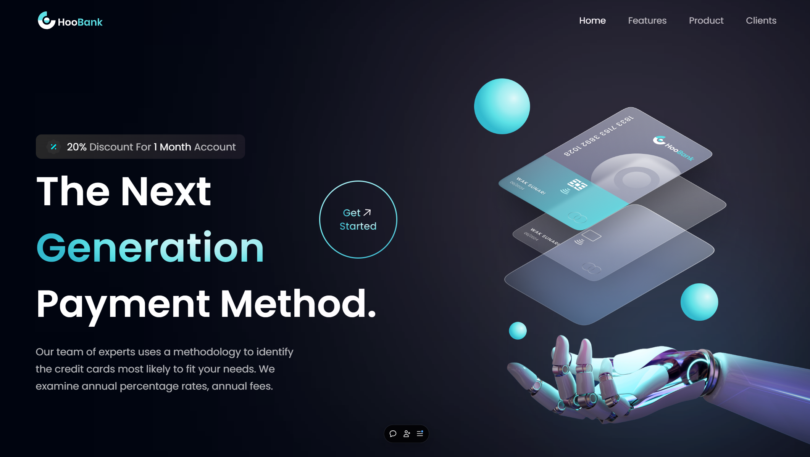

# HooBank - Modern UI/UX Website

HooBank is a modern, responsive, and visually appealing website designed to showcase financial services and solutions. Built using **React.js** and **Tailwind CSS**, this project emphasizes a clean, user-friendly UI/UX that adapts seamlessly to any device.

## Features

- **Responsive Design**: Fully optimized for various screen sizes, including desktops, tablets, and smartphones.
- **Modern UI/UX**: Sleek and contemporary design elements to enhance the user experience.
- **Reusable Components**: Modular React components that are easy to maintain and extend.
- **Custom Animations**: Subtle animations to add a dynamic feel to the user interface.
- **Tailwind CSS Styling**: Rapid UI development with utility-first CSS.

## Demo

Check out the live demo of the project [here](https://hoobank-sanskargupta0s-projects.vercel.app/).




## Installation and Setup

To get started with the HooBank project, follow these steps:

1. Clone the repository:
    ```bash
    git clone https://github.com/Sanskargupta0/HooBank.git
    ```

2. Navigate to the project folder:
    ```bash
    cd hoobank
    ```

3. Install dependencies:
    ```bash
    npm install
    ```

4. Run the development server:
    ```bash
    npm start
    ```

5. Open your browser and go to `http://localhost:3000` to view the app.

